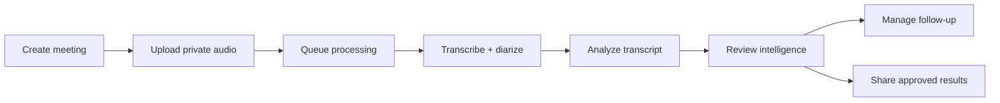
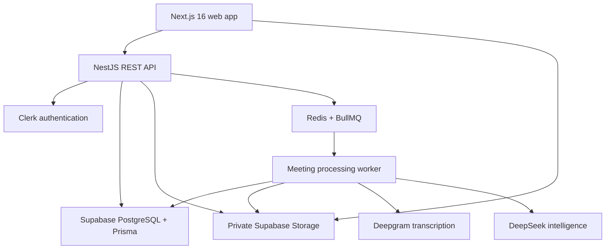

# AI Meeting Intelligence System

AI Meeting Intelligence System turns private meeting recordings into searchable, speaker-labelled transcripts and structured follow-up. Users can upload audio, follow durable background processing, review evidence-backed summaries and decisions, manage action items, rename speakers, and share approved results without exposing the source recording.

The application is built for teams that need meeting output to remain useful after the call: traceable to the transcript, recoverable when processing fails, and secure by default.

## What the project does

- Creates a private, user-owned library of meetings.
- Uploads MP3, WAV, and M4A recordings directly to private Supabase Storage with resumable TUS uploads.
- Transcribes recordings with Deepgram Whisper, including timestamps, language detection, and speaker diarization.
- Generates structured summaries, key topics, outcomes, and unresolved issues with DeepSeek.
- Extracts decisions and action items with supporting evidence and source timestamps.
- Lets users search a transcript, jump to exact moments, and replace generated speaker labels with real names.
- Supports editing an action item's task, owner, due date, priority, and workflow status.
- Exports all meeting action items as a detailed checklist page in a user-selected Notion destination.
- Runs processing asynchronously with BullMQ, durable PostgreSQL state, progress reporting, retries, and safe failure recovery.
- Creates expiring or permanent public result links that can be revoked without exposing meeting audio.
- Isolates every authenticated meeting operation by Clerk user ownership.
- Ships as a pnpm/Turborepo monorepo with Docker images for the web app and API.

## Product workflow



Processing moves through visible, persisted states:

`UPLOADED → QUEUED → PREPROCESSING → TRANSCRIBING → ANALYZING → COMPLETED`

Terminal failures move the meeting to `FAILED`. A retry reuses an existing valid transcript when possible, avoiding unnecessary retranscription cost; a full reprocess can deliberately regenerate the transcript.

## Core areas

### Meeting workspace

The meeting library provides cursor-based browsing, processing status, high-level result counts, and meeting management. Each meeting belongs to one Clerk user and supports one private recording at a time.

### Transcript workspace

Deepgram returns timestamped, speaker-labelled segments that are stored as a durable transcript. Users can search the conversation, navigate to source moments, and rename detected speakers without changing the underlying transcript evidence.

### Meeting intelligence

DeepSeek analyzes a deterministic transcript representation in separate summary, decision, and action-item stages. Every provider response is parsed as JSON and validated with shared Zod schemas before it is persisted. Decisions and action items retain evidence text and, when available, a source segment and timestamp.

### Action tracking

Generated action items remain operational after processing. A user can correct the task, owner, due date, and priority, then move work through `OPEN`, `IN_PROGRESS`, and `COMPLETED` states.

### Secure sharing

Meeting owners can create links that expire after 24 hours, 7 days, or 30 days, or never expire. Public pages contain approved meeting results and transcript content, but never audio metadata or playback URLs. Creating a new link revokes the previous active link, and links can be revoked at any time.

## Architecture



The browser receives a short-lived, user-scoped upload authorization and sends the recording directly to Supabase. Once the upload is confirmed, the API transactionally moves the meeting and its processing record to `QUEUED`, then submits the small `{ meetingId }` payload to BullMQ. The worker always reloads authoritative meeting data from PostgreSQL before doing work.

PostgreSQL is the browser-visible source of truth across refreshes and restarts. Redis coordinates background execution and retry recovery; it is not the canonical store for meeting state or generated intelligence.

## Technology stack

| Area                  | Technology                                                           |
| --------------------- | -------------------------------------------------------------------- |
| Web application       | Next.js 16 App Router, React 19, TypeScript                          |
| UI and data           | Tailwind CSS, Radix UI, TanStack Query, React Hook Form, Motion      |
| API                   | NestJS 10, REST, Zod and class-validator                             |
| Authentication        | Clerk sessions, bearer-token verification, signed webhooks           |
| Database              | Supabase PostgreSQL, Prisma 6                                        |
| File storage          | Private Supabase Storage, signed URLs, resumable TUS uploads         |
| Background processing | Redis 8, BullMQ 5                                                    |
| Speech to text        | Deepgram Whisper with diarization                                    |
| AI analysis           | DeepSeek through an OpenAI-compatible client                         |
| Observability         | Structured request logs, correlation IDs, optional LangSmith tracing |
| Tooling               | pnpm 9, Turborepo, ESLint, Prettier, Docker Compose                  |

## Repository structure

```text
apps/
├── web/                         # Next.js frontend and public share pages
│   └── src/
│       ├── app/                 # Landing, auth, meeting, and share routes
│       └── features/meetings/   # Meeting UI, API hooks, uploads, and utilities
└── api/                         # NestJS API and in-process BullMQ worker
    └── src/
        ├── auth/                # Clerk authentication and user resolution
        ├── intelligence/        # DeepSeek prompts, validation, and persistence
        ├── jobs/                # Queue configuration and meeting processor
        ├── meetings/            # Meeting, upload, transcript, and retry endpoints
        ├── notion/              # Notion OAuth, page discovery, and checklist export
        ├── sharing/             # Expiring public result links
        ├── storage/             # Private Supabase Storage access
        ├── transcription/       # Deepgram provider and normalization
        └── webhooks/            # Clerk user lifecycle synchronization

packages/
├── database/                    # Prisma schema, migrations, and generated client
├── schemas/                     # Shared Zod request and AI-output schemas
└── types/                       # Shared API contracts
```

## Prerequisites

- Node.js 20.9 or newer
- pnpm 9 or newer
- Docker with Docker Compose
- A Supabase project with PostgreSQL and a private Storage bucket
- A Clerk application
- A Deepgram API key
- A DeepSeek API key

## Local setup

### 1. Install dependencies

```bash
pnpm install
```

### 2. Create environment files

Copy the checked-in examples:

```bash
cp .env.example .env
cp packages/database/.env.example packages/database/.env
cp apps/web/.env.example apps/web/.env.local
```

On PowerShell:

```powershell
Copy-Item .env.example .env
Copy-Item packages/database/.env.example packages/database/.env
Copy-Item apps/web/.env.example apps/web/.env.local
```

Use the root `.env` for backend services, `packages/database/.env` for Prisma CLI access, and `apps/web/.env.local` for the browser-safe Next.js configuration. Never place a secret or service-role credential in a `NEXT_PUBLIC_*` variable.

### 3. Prepare Supabase

1. Set `DATABASE_URL` in `packages/database/.env` and the root `.env`.
2. Apply the committed Prisma migrations:

   ```bash
   pnpm db:deploy
   ```

3. Create a private Storage bucket named `meeting-audio`, or use the name in `SUPABASE_STORAGE_BUCKET`.
4. Add the Supabase project URL and service-role key to the backend environment.

The API verifies that the configured audio bucket is private before it authorizes an upload.

### 4. Configure Clerk

1. Create a Clerk application.
2. Put the publishable key in the web environment and the backend publishable key in the root environment.
3. Put `CLERK_SECRET_KEY` only in the backend/root environment.
4. Set `CLERK_AUTHORIZED_PARTIES` and `FRONTEND_URL` to the legitimate frontend origin.
5. Create a webhook at `https://your-api.example/api/v1/webhooks/clerk` for `user.created`, `user.updated`, and `user.deleted`.
6. Store its signing secret as `CLERK_WEBHOOK_SECRET`.

The API independently verifies Clerk bearer tokens. A deletion webhook anonymizes the local profile while preserving meeting records for retention; it does not cascade-delete user meetings.

### 5. Configure Notion

1. Create a public connection in the Notion developer portal with Read Content and Insert Content capabilities.
2. Register `NOTION_REDIRECT_URI` as an OAuth redirect URI. For local development, use `http://localhost:3001/api/v1/integrations/notion/oauth/callback`.
3. Set `NOTION_CLIENT_ID` and `NOTION_CLIENT_SECRET` in the backend environment.
4. Generate a dedicated 32-byte encryption key, encode it as base64, and store it as `NOTION_TOKEN_ENCRYPTION_KEY`.

Each app user authorizes one Notion workspace and chooses which pages the connection can access. Access and refresh tokens are encrypted before they are stored.

### 6. Configure AI providers

Add `DEEPGRAM_API_KEY` and `DEEPSEEK_API_KEY` to the root `.env`. The default provider configuration is:

```dotenv
DEEPGRAM_TRANSCRIPTION_MODEL=whisper
DEEPGRAM_DIARIZATION_MODEL=latest
DEEPSEEK_MODEL=deepseek-v4-flash
DEEPSEEK_BASE_URL=https://api.deepseek.com
```

### 7. Start the application

Start Redis, generate Prisma Client, and run the web and API workspaces:

```bash
docker compose up -d redis
pnpm db:generate
pnpm dev
```

Open [http://localhost:3000](http://localhost:3000). The API is available at [http://localhost:3001/api/v1](http://localhost:3001/api/v1).

## Environment reference

| Variable                            | Required     | Purpose                                               |
| ----------------------------------- | ------------ | ----------------------------------------------------- |
| `DATABASE_URL`                      | Yes          | PostgreSQL connection used by Prisma and the API      |
| `FRONTEND_URL`                      | Yes          | Comma-separated browser origins allowed by CORS       |
| `CLERK_AUTHORIZED_PARTIES`          | Yes          | Allowed Clerk token originating parties               |
| `NEXT_PUBLIC_CLERK_PUBLISHABLE_KEY` | Yes          | Browser-safe Clerk key                                |
| `CLERK_PUBLISHABLE_KEY`             | Yes          | Backend Clerk publishable key                         |
| `CLERK_SECRET_KEY`                  | Yes          | Server-only Clerk credential                          |
| `CLERK_JWT_KEY`                     | No           | PEM public key for networkless token verification     |
| `CLERK_WEBHOOK_SECRET`              | Recommended  | Verifies Clerk lifecycle webhooks                     |
| `NOTION_CLIENT_ID`                  | Yes          | Public Notion connection identifier                   |
| `NOTION_CLIENT_SECRET`              | Yes          | Server-only Notion OAuth credential                   |
| `NOTION_REDIRECT_URI`               | Yes          | Registered Notion OAuth callback URL                  |
| `NOTION_TOKEN_ENCRYPTION_KEY`       | Yes          | Base64 32-byte key for stored Notion tokens           |
| `NEXT_PUBLIC_API_URL`               | Yes          | Browser-facing REST API base URL                      |
| `SUPABASE_URL`                      | Yes          | Backend Supabase project URL                          |
| `SUPABASE_SERVICE_ROLE_KEY`         | Yes          | Server-only Storage administration key                |
| `SUPABASE_STORAGE_BUCKET`           | No           | Private recording bucket; defaults to `meeting-audio` |
| `NEXT_PUBLIC_SUPABASE_URL`          | Yes          | Browser-safe Supabase project URL                     |
| `NEXT_PUBLIC_SUPABASE_ANON_KEY`     | Yes          | Browser-safe Supabase anonymous key                   |
| `DEEPGRAM_API_KEY`                  | Yes          | Server-only speech-to-text credential                 |
| `DEEPSEEK_API_KEY`                  | Yes          | Server-only analysis credential                       |
| `REDIS_URL`                         | No           | Redis URL; overrides `REDIS_HOST` and `REDIS_PORT`    |
| `LANGSMITH_TRACING`                 | No           | Enables server-side AI call tracing                   |
| `LANGSMITH_API_KEY`                 | When tracing | LangSmith credential                                  |
| `LANGSMITH_PROJECT`                 | When tracing | LangSmith destination project                         |
| `TRUST_PROXY`                       | Production   | Exact trusted reverse-proxy hop count                 |
| `MEETING_WORKER_CONCURRENCY`        | No           | Concurrent meeting jobs; defaults to `2`              |
| `MAX_ACTIVE_MEETINGS_PER_USER`      | No           | Per-user processing admission limit; defaults to `3`  |
| `MEETING_JOB_ATTEMPTS`              | No           | Attempts including the first run; defaults to `3`     |
| `MEETING_JOB_BACKOFF_MS`            | No           | Exponential retry base delay; defaults to `2000`      |
| `MAX_AUDIO_FILE_SIZE_MB`            | No           | Recording size limit; defaults to `50`                |

Timeouts, rate limits, ports, model overrides, cleanup age, and FFmpeg paths are documented inline in [`.env.example`](.env.example).

## Application routes

| Route            | Description                                                       |
| ---------------- | ----------------------------------------------------------------- |
| `/`              | Public product landing page                                       |
| `/sign-in`       | Clerk sign-in                                                     |
| `/sign-up`       | Clerk registration                                                |
| `/meetings`      | Authenticated meeting library                                     |
| `/meetings/[id]` | Transcript, intelligence, audio, sharing, and follow-up workspace |
| `/share/[token]` | Public, revocable meeting-results page                            |

## API overview

All API paths use the `/api/v1` prefix.

| Endpoint                                         | Purpose                                            |
| ------------------------------------------------ | -------------------------------------------------- |
| `GET /health`                                    | Liveness check                                     |
| `GET /health/ready`                              | PostgreSQL and Redis readiness check               |
| `POST /meetings`                                 | Create a meeting                                   |
| `GET /meetings`                                  | List the current user's meetings                   |
| `POST /meetings/:id/audio/upload-url`            | Authorize a private resumable upload               |
| `POST /meetings/:id/audio/confirm`               | Confirm the stored recording                       |
| `POST /meetings/:id/process`                     | Queue processing and return `202`                  |
| `GET /meetings/:id/status`                       | Read durable processing state                      |
| `GET /meetings/:id/transcript`                   | Read the speaker-labelled transcript               |
| `PATCH /meetings/:meetingId/speakers/:speakerId` | Rename a detected speaker                          |
| `GET /meetings/:id/intelligence`                 | Read summary, decisions, and action items          |
| `PATCH /action-items/:id`                        | Edit or advance an action item                     |
| `GET /integrations/notion`                       | Read the current user's Notion connection          |
| `POST /integrations/notion/oauth/start`          | Start user-scoped Notion OAuth                     |
| `GET /integrations/notion/oauth/callback`        | Complete Notion OAuth                              |
| `GET /integrations/notion/pages`                 | Search accessible Notion parent pages              |
| `DELETE /integrations/notion`                    | Revoke and remove the Notion connection            |
| `POST /meetings/:meetingId/exports/notion`       | Export action items as a Notion checklist          |
| `POST /meetings/:meetingId/shares`               | Create a public result link                        |
| `DELETE /meetings/:meetingId/shares/:shareId`    | Revoke a result link                               |
| `GET /shares/:token`                             | Read shared meeting results without authentication |

## Commands

| Command             | Description                                           |
| ------------------- | ----------------------------------------------------- |
| `pnpm dev`          | Run the web app and API through Turborepo             |
| `pnpm build`        | Build packages and applications in dependency order   |
| `pnpm lint`         | Lint every workspace                                  |
| `pnpm typecheck`    | Type-check every workspace                            |
| `pnpm format`       | Format the repository with Prettier                   |
| `pnpm format:check` | Check formatting without changing files               |
| `pnpm db:generate`  | Generate Prisma Client                                |
| `pnpm db:migrate`   | Create and apply a development migration              |
| `pnpm db:deploy`    | Apply committed migrations in deployment environments |
| `pnpm db:studio`    | Open Prisma Studio                                    |

Targeted regression suites are available in the application workspaces:

```bash
pnpm --filter @meeting-intelligence/api test:intelligence
pnpm --filter @meeting-intelligence/api test:meetings
pnpm --filter @meeting-intelligence/api test:auth
pnpm --filter @meeting-intelligence/api test:transcription
pnpm --filter @meeting-intelligence/api test:hardening
pnpm --filter @meeting-intelligence/api test:notion
pnpm --filter @meeting-intelligence/web test:meeting-utils
```

## Docker deployment

Build and start the complete local production stack after configuring the root `.env` and applying migrations:

```bash
pnpm db:deploy
docker compose up --build -d
docker compose ps
```

This starts:

- `web` at [http://localhost:3000](http://localhost:3000)
- `api` at [http://localhost:3001](http://localhost:3001)
- `redis` on the internal Compose network, with data persisted in `redis-data`

The images are tagged `meeting-intelligence-web:local` and `meeting-intelligence-api:local` by default. Stop the stack with `docker compose down`.

For each production release:

```bash
pnpm install --frozen-lockfile
pnpm db:generate
pnpm db:deploy
pnpm typecheck
pnpm lint
pnpm build
```

Deploy committed migrations before starting the new API. Use `prisma migrate deploy` in deployment environments; do not use `prisma migrate dev` there.

## Security model

- Meeting, transcript, intelligence, audio, and share-management queries are scoped to the authenticated Clerk user.
- The browser never receives Clerk secrets, the Supabase service-role key, database credentials, or model API keys.
- Recordings live in a private bucket under user-scoped object paths.
- Owners receive five-minute signed playback URLs; anonymous share responses never include audio access.
- Share tokens contain 256 bits of randomness and only their SHA-256 hashes are stored.
- Expired and revoked links return the same unavailable response to anonymous callers.
- Generated intelligence is persisted only after strict schema validation.
- Helmet, explicit CORS origins, request correlation IDs, structured logs, and user-aware throttling protect the API boundary.
- Deleting a meeting cascades its database-owned transcript, intelligence, processing, and share records, then removes referenced Storage objects.

## Processing and recovery guarantees

Queue jobs use stable IDs to reject duplicate active work. Meeting state and its single processing record are updated transactionally at each pipeline transition. Automatic failures retry with exponential backoff; terminal failures persist a safe error for the user.

If transcription succeeds but analysis fails, the transcript remains stored. A normal retry resumes from analysis, while the explicit reprocess route forces a fresh Deepgram transcription. Intelligence replacement happens in one transaction only after all generated outputs pass validation, preventing partially updated results.

The current deployment runs the API and BullMQ worker in the same NestJS process. A larger production deployment can separate workers and add distributed reconciliation without changing the persisted meeting lifecycle.

## Current scope

The system processes one recording per meeting and sends each recording to Deepgram as a single remote-URL transcription request. It does not currently provide live meeting capture, calendar integrations, collaborative editing, or long-recording chunking. Generated summaries and extracted follow-up should be reviewed against the linked transcript evidence before they drive consequential work.

## License

No open-source license is currently declared. Add a `LICENSE` file before distributing the project or accepting contributions under specific terms.
